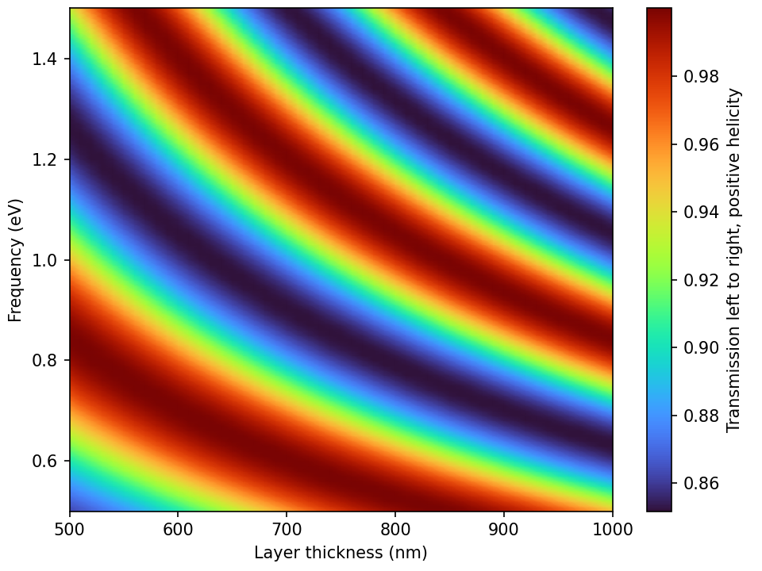
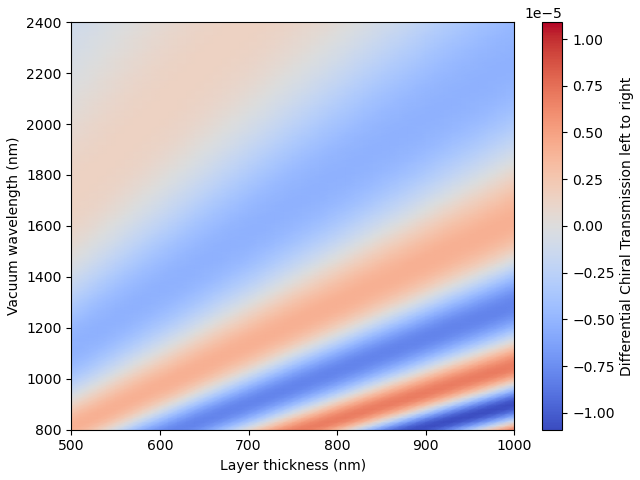

# Introduction

TSCAT is a Python library using the transfer matrix approach for calculating scattering properties of multilayer structures including chiral materials, and allowing for the inclusion of arbitrary optical elements (such as metamaterial mirrors) that are defined by their transfer matrix (assumed to be calculated/modeled externally).

# Installation

Install the package with `pip`:
```bash
pip install tscat
```

# Usage
All the following examples assume that the following modules are imported:
```python
import tscat as ts
import numpy as np
import matplotlib.pyplot as plt
```

## Simple example
An extremely simple example (a 100nm dielectric layer surrounded by air) is given by the following:
```python
air_infty = ts.MaterialLayer(d=np.inf, eps=1, kappa=0, mu=1)
dielectric = ts.MaterialLayer(d=100., eps=2.25, kappa=0, mu=1)
layers = [air_infty, dielectric, air_infty]
omega = [0.5, 1.0, 1.5]
theta0 = 0
tScat = ts.TScat(layers, omega, theta0)
```

Here, the elements of `layers` can be either:
- `MaterialLayer` objects representing a uniform material layer, which are constructed with the following arguments:
    - `d`: thickness of the layer (in nm)
    - `eps`: dielectric constant of the layer
    - `kappa`: Pasteur chirality parameter of the layer (default: 0)
    - `mu`: magnetic permeability of the layer (default: 1)
- `TransferMatrixLayer` objects representing an arbitrary optical element defined by its transfer matrix (assumed to be calculated/modeled externally), and constructed with a single argument:
    - `M`: 4x4 transfer matrix of the optical element.

The "main" class is `TScat`, which calculates the scattering properties of the structure upon instantiation and takes the following arguments:
- `layers`: list describing the layers of the structure
- `omega`: frequency (in eV)
- `theta0`: incidence angle (in radians)

The scattering properties can then be accessed as attributes of the returned object `tScat`, e.g.:
```python
> print(tScat.Tsp)
[0.97666235 0.92385092 0.87460948]
```
Here, `Tsp` is the transmission (`T`) probability from left to right (`s`) for positively polarized circular light (`p`) at the three frequencies. The eight available scattering probabilities are: `Tsp`, `Tsm`, `Tdp`, `Tdm`, `Rsp`, `Rsm`, `Rdp`, `Rdm`, where the letters stand for:
- `T`/`R`: Transmission / Reflection probability
- `s`/`d`: Light propagating from left to right (`sinister`) / right to left (`dexter`)
- `p`/`m`: Positively / negatively circular polarized light

The full scattering amplitudes (and not just probabilities) are also available:
```python
> print(tScat.ts)
[[[0.91032471+3.85610033e-01j 0.00275845-2.67169949e-03j]
  [0.00275845-2.67169949e-03j 0.91032471+3.85610033e-01j]]

 [[0.68037644+6.80320869e-01j 0.00677529-2.17493982e-07j]
  [0.00677529-2.17493982e-07j 0.68037644+6.80320869e-01j]]

 [[0.38357693+8.54040341e-01j 0.00635712+5.65022470e-03j]
  [0.00635712+5.65022470e-03j 0.38357693+8.54040341e-01j]]]
```
which gives the transmission/reflection (`t`/`r`) amplitudes from left to right/right to left (`s`/`d`). In the example above, these are `3×2×2` arrays, where the first index is the frequency, the second is the output polarization (in order `p`/`m`), and the third is the input polarization (same order). Since the amplitudes are not diagonal in polarization, this output is always in matrix form (the probabilities with capital letters above are summed over the output polarization).

## Parameter scans
Importantly, the `TScat` interface is written to follow the [numpy broadcasting conventions](https://numpy.org/doc/stable/user/basics.broadcasting.html), so that scanning over any desired combination of parameters is easy:
```python
# we want to scan over layer thickness d AND frequency omega
# so make them a 51-element 1D and a 101x1 2D array, respectively
# to give you 101x51 2D output arrays
d = np.linspace(500, 1000, 51)
omega = np.linspace(0.5, 1.5, 101)[:,None]

air_infty = ts.MaterialLayer(d=np.inf, eps=1)
dielectric = ts.MaterialLayer(d=d, eps=2.25)
layers = [air_infty, dielectric, air_infty]
theta0 = 0.3
tScat = ts.TScat(layers, omega, theta0)

plt.pcolormesh(d, omega, tScat.Tsp, cmap='turbo', shading='gouraud')
plt.colorbar()
plt.xlabel('Layer thickness (nm)')
plt.ylabel('Frequency (eV)')
plt.tight_layout(pad=0.5)
```


## Chiral materials
We now make the dielectric material chiral, with Pasteur chirality parameter `kappa=1e-3`. Since this is small, the transmission for left- and right-circular polarized light are visually indistinguishable, and we instead plot the differential chiral transmission DCT = 2(Tp - Tm)/(Tp + Tm):
```python
d = np.linspace(500, 1000, 51)
omega = np.linspace(0.5, 1.5, 101)[:,None]

air_infty = ts.MaterialLayer(d=np.inf, eps=1)
dielectric = ts.MaterialLayer(d=d, eps=2.25, kappa=1e-3)
layers = [air_infty, dielectric, air_infty]
theta0 = 0.3
tScat = ts.TScat(layers, omega, theta0)

vmax = abs(tScat.DCTs).max()
plt.pcolormesh(d, omega, tScat.DCTs, cmap='coolwarm',
               vmin=-vmax, vmax=vmax, shading='gouraud')
cb = plt.colorbar()
cb.set_label('Differential Chiral Transmission left to right')
plt.xlabel('Layer thickness (nm)')
plt.ylabel('Frequency (eV)')
plt.tight_layout(pad=0.5)
```


## Arbitrary layers defined by their transfer matrix

TSCAT also supports the use of layers that are not just uniform material layers, but, e.g., metamaterials described by a transfer matrix that is externally provided. This is done by passing a `TransferMatrixLayer` object, which is a simple container for the transfer matrix. The transfer matrix must be as a `...×4×4` array, where the `...` indicate an arbitrary number of dimensions that are treated according to broadcasting rules (e.g., these can describe frequency dependence), and the last two dimension describe the transfer matrix, where the 4 entries correspond to (`sp`,`sm`,`dp`,`dm`) waves (where again, `s`/`d` stand for left- and right-going waves, and `p`/`m` correspond to helicity of plus/minus 1). For example, this can be used to describe a helicity-preserving mirror, and the model described in [Phys. Rev. A 107, L021501 (2021)](https://doi.org/10.1103/PhysRevA.107.L021501) is already provided in the code with a separate helper function `helicity_preserving_mirror(omegaPR,gammaPR,omega,reversed=False)` that returns the transfer matrix for a mirror with a helicity-preserving resonance at frequency `omegaPR` and with linewidth `gammaPR`, for frequencies `omega`. The `reversed` argument can be used to reverse the direction of the mirror, as necessary for creating a helicity-preserving cavity.


## Multilayers for Standard FP

The next script shows the multilayer structure for a standard FP cavity, where the oscillator strength of the LHIC medium (denoted as CHIRAL MATERIAL in the code) defined as $\\omega\_{p}\\sqrt{f}$ is varied. Note the structure of the list called **m****a****t****T****O****T**. This list changes in case of a standard or alternative (in this work preserving) FP cavity. At the end of the script, the computed observables are shown: **T****s****p** (*T*<sub>+</sub><sup>→</sup> for light propagation from right to left), **T****s****m** (*T*<sub>−</sub><sup>→</sup>), **R****s****p** (*R*<sub>+</sub><sup>←</sup> for light propagation from right to left), **R****s****m** (*R*<sub>−</sub><sup>←</sup>) and **d****c****t****\_****s** (𝒟𝒞𝒯 for light propagation from right to left). In case the user is interested in computing the same observables but for the opposite light propagation has to type **T****d****p**, **T****d****m**, **R****d****p**, **R****d****m** or **d****c****t****\_****d** respectively. The user can also type **d****c****r****\_****s** (𝒟𝒞ℛ for light propagation from left to right) or **d****c****r****\_****d** (𝒟𝒞ℛ for light propagation from right to left). The letter s stands for sinister (latin word to say “on the left-side”) and d stands for dexter (latin word to say “on the right-side”).

```python
coupl = np.linspace(0.0, 1.0, 100)

Tplist = []
Tmlist = []
Rplist = []
Rmlist = []
DCTlist = [] 

for i in range(len(coupl)):
    
    ################
    # INCIDENT ANGLE
    ################
    theta0 = 0.0
    ################
    
    #####
    # AIR
    ##############
    n1 = 1 * ngrid
    mu1 = 1 * ngrid
    k1 = 0 * ngrid
    d1 = np.inf
    ##############
    
    ########
    # MIRROR
    ########################################################################################
    epsinf = 4.77574276
    omegapMirr = 9.48300763
    eps2, n2, k2 = eps_DL(epsinf, omegapMirr, omega, omega0 = 0, gamma = 0.17486845, k0 = 0)
    mu2 = 1 * ngrid
    k2 = 0 * ngrid
    d2 = 30
    ########################################################################################   

    #################
    # CHIRAL MATERIAL
    ##########################################################################################
    epsinf = 2.89
    omegapChiral = coupl[i]
    eps3M, n3, k3 = eps_DL(epsinf, omegapChiral, omega, omega0 = 2.0, gamma = 0.05, k0 = 1e-3)
    mu3 = 1 * ngrid
    dL = 150
    ########################################################################################## 

    ########
    # MIRROR
    ########################################################################################
    epsinf = 4.77574276
    omegapMirr = 9.48300763
    eps4, n4, k4 = eps_DL(epsinf, omegapMirr, omega, omega0 = 0, gamma = 0.17486845, k0 = 0)
    mu4 = 1 * ngrid
    k4 = 0 * ngrid
    d4 = 30
    ######################################################################################## 

    #####
    # AIR
    ##############
    n5 = 1 * ngrid
    mu5 = 1 * ngrid
    k5 = 0 * ngrid
    d5 = np.inf
    ##############
    
    ########################################
    # ALL THE ARRAYS OF THE INPUT PARAMETERS
    ####################################################
    nTOT = [n1, n2, n3, n4, n5]
    muTOT = [mu1, mu2, mu3, mu4, mu5]
    kTOT = [k1, k2, k3, k4, k5] 
    dTOT = [d1, d2, dL, d4, d5] 
    matTOT = ['air', 'mirr', 'ChiralMat', 'mirr', 'air']
    ####################################################
    
    ######################
    # CALLING OF THE CLASS
    ################################################################
    tScat = ts.TScat(theta0, nTOT, muTOT, kTOT, dTOT, omega, matTOT)  
    ################################################################
    
    Tplist.append(tScat.Tsp)
    Tmlist.append(tScat.Tsm)
    Rplist.append(tScat.Rsp)
    Rmlist.append(tScat.Rsm)
    DCTlist.append(tScat.dct_s)
    
#############
# OBSERVABLES
#######################    
arr1 = np.array(Tplist)
arr2 = np.array(Tmlist)
arr3 = np.array(Rplist)
arr4 = np.array(Rmlist)
arr5 = np.array(DCTlist)
```

## Multilayers for Preserving FP

The only difference with respect to the standard layers, presented in the previous section, consists in adding a thin layer of air before and after the modelled metamirrors and to insert the word **C****u****s****t****o****m** in the list called **m****a****t****T****O****T**. All the other words are not case sensitive.

```python
coupl = np.linspace(0.0, 1.0, 100)

Tplist = []
Tmlist = []
Rplist = []
Rmlist = []
DCTlist = []
DCAlist = []

for i in range(len(coupl)):
    
    ################
    # INCIDENT ANGLE
    ################
    theta0 = 0
    ################

    ######
    # AIR
    ##############
    n1 = 1 * ngrid
    mu1 = 1 * ngrid
    k1 = 0 * ngrid
    d1 = np.inf
    ##############

    #####################
    # PRESERVING MIRROR 1
    #######################################
    k2 = 0 * ngrid
    mu2 = 1 * ngrid
    n2 = 1 * ngrid
    d2 = 0  # the distance has no influence
    #######################################
    
    #####
    # AIR 
    ###############
    n3 = 1 * ngrid
    mu3 = 1 * ngrid
    k3 = 0 * ngrid
    d3 = 0.01
    ###############

    #################
    # CHIRAL MATERIAL
    #########################################################################################
    epsinf = 2.89
    omegapChiral = coupl[i]
    eps4M, n4, k4 = eps_DL(epsinf, omegapChiral, omega, omega0 = 2.0, gamma = 0.05, k0 = 0.0)
    mu4 = 1 * ngrid
    k4 = 0 * ngrid
    dL = 180
    ######################################################################################### 
        
    #####
    # AIR 
    ###############
    n5 = 1 * ngrid
    mu5 = 1 * ngrid
    k5 = 0 * ngrid
    d5 = 0.01
    ###############

    #####################
    # PRESERVING MIRROR 2
    ######################################
    k6 = 0 * ngrid
    mu6 = 1 * ngrid
    n6 = 1 * ngrid
    d6 = 0 # the distance has no influence
    ######################################  

    #####
    # AIR
    ###############
    n7 = 1 * ngrid
    mu7 = 1 * ngrid
    k7 = 0 * ngrid
    d7 = np.inf
    ###############

    ########################################
    # ALL THE ARRAYS OF THE INPUT PARAMETERS
    #############################################################################
    nTOT = [n1, n2, n3, n4, n5, n6, n7]
    muTOT = [mu1, mu2, mu3, mu4, mu5, mu6, mu7]
    kTOT = [k1, k2, k3, k4, k5, k6, k7] 
    dTOT = [d1, d2, d3, dL, d5, d6, d7] 
    matTOT = ['air', 'Custom', 'air', 'ChiralMat', 'air', 'Custom', 'air']
    #############################################################################

    ######################
    # CALLING OF THE CLASS 
    #########################################################################
    tScat = ts.TScat(theta0, nTOT, muTOT, kTOT, dTOT, omega, matTOT, scatTOT)  
    #########################################################################
    
    Tplist.append(tScat.Tsp)
    Tmlist.append(tScat.Tsm)
    Rplist.append(tScat.Rsp)
    Rmlist.append(tScat.Rsm)
    DCTlist.append(tScat.dct_s)
    
#############
# OBSERVABLES
########################    
arr1 = np.array(Tplist)
arr2 = np.array(Tmlist)
arr3 = np.array(Rplist)
arr4 = np.array(Rmlist)
arr5 = np.array(DCTlist)
```

## 2D Map

Here, we show a simple example to make a 2D map.

``` python
plt.pcolormesh(coupl, omega, arr1.T, shading = 'gouraud', cmap = 'turbo') 
plt.xlabel(r"$\hbar\omega_{p}\sqrt{f}\mathrm{[eV]}$", size = 23)
plt.ylabel(r"$ħ ω \mathrm{[eV]}$", size = 23)
cbar = plt.colorbar()
cbar.set_label(r'$T_{+}$', labelpad = -10, y = 1.05, rotation = 0, size = 14)
plt.show() 
```

# Fields in cavity

TSCAT is able to compute the amplitudes of the polarized electric fields in a given layer. Here we show two examples of the intensity of the LCP and RCP field when LCP impinges on the cavity made by preserving mirrors. The multilayers structure is similar to the structure presented in Listing \[multPres\] with the difference that here we consider an empty cavity. Before defining all the layers, we define the range of the distance of the intracavity space called **l**, and the list of the amplitudes called **a****m****p****l**. Eventually, the list of the amplitudes is filled by calling a function of the source code: **c****a****l****c****\_****a****m****p****l****(****)**. This function has three arguments: the first is the number of the layer the user wants to study, the second is in the form \[1, 0\] for incoming LCP, \[0, 1\] for incoming RCP and \[1, 1\] for a mixture of both polarizations. The third argument contains the frequency *ω* in units of eV. The list **a****m****p****l** is then reshaped with arguments **l****e****n****(****l****)**, the 4 polarized field intensities **E****l****p** (*E*<sub>→</sub><sup>+</sup>), **E****r****p** (*E*<sub>←</sub><sup>+</sup>), **E****l****m** (*E*<sub>→</sub><sup>−</sup>), **E****r****m** (*E*<sub>←</sub><sup>−</sup>) and the **l****e****n****(****l****)**. Finally, the total contribution of the polarized intensities is collected in **l****c****p** and **r****c****p**.

```python
l = np.linspace(150, 450, 600)
ampl = list()

#############
# MULTILAYERS
.......
############

    ampl.append(tScat.calc_ampl(2, [0, 1], omega))  # field in cavity for an incoming LCP wave

#############
# OBSERVABLES
#####################################################################################
ampl2 = np.array(ampl).reshape(len(l), 4, len(omega)) 
Elp = ampl2[:, 0, :]
Elm = ampl2[:, 1, :]
Erp = ampl2[:, 2, :]
Erm = ampl2[:, 3, :]
lcp = Elp * Elp.conj() + Erp * Erp.conj()  # total LCP in layer 2 (inside the cavity)
rcp = Elm * Elm.conj() + Erm * Erm.conj()  # total RCP in layer 2 (inside the cavity)
#####################################################################################
```

Figure \[LCPlcp\] shows the case when the cavity is illuminated by LCP light. In this case the LCP light is largely acumulated inside the cavity near the HP region. In contrast, at resonance the cavity is filled only by RCP light when LCP shines on the cavity, due to the efficient cross-convertion of polarization from LCP to RCP. This aspect is shown in Figure \[RCPlcp\].

<embed src="LCPlcp.pdf" />

<embed src="RCPlcp.pdf" />
